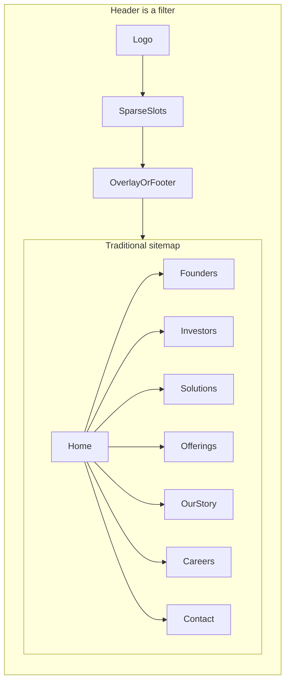

# Header vs sitemap: three non-traditional chrome options

> **Historical draft (pre–sitemap lock).** The body below describes the original
> comparison pass. **For Investors was deleted 2026-09-10** — see the supersede
> section at the bottom and [`sitemap-lock.md`](./sitemap-lock.md) for the locked tree.

## Split the two jobs

The sitemap is the **inventory** (what pages exist, how they nest, what we design in the 25-page budget). The header is a **wayfinding instrument**. They must use the same labels and destinations, but they do not have to show the same number of items.

**Current mismatch**

- [prototypes/sitemap.html](../prototypes/sitemap.html) L1 rail: For Founders · For Investors · Solutions · Offerings · Our Story · Careers, plus utility note for Contact + “Explore Solutions”.
- [prototypes/header-wireframe.html](../prototypes/header-wireframe.html): same six links + Contact + CTA (traditional mega-nav).
- Homepage [homepage-bendingspoons-style.html](../prototypes/homepage-wireframe/v0.1-rough/homepage-bendingspoons-style.html): Solutions · Offerings · Our Story | For Founders | Explore CTA. **Investors and Careers missing**; audience-led KB decision ([PROJECT_KNOWLEDGE_BASE.md](../PROJECT_KNOWLEDGE_BASE.md) §14) is inverted (portfolio in chrome, founders as a quiet right-side link).

Constraint to keep in all variants: **Offerings** (never Platform); hero CTA remains **Explore our vertical solutions**; no header search.

## Three header patterns (same sitemap underneath)

**A — Menu as the map (Quilt / Bending Spoons sparse)**
Chrome: logo + **Menu** (or Explore) + one primary CTA. Opening Menu reveals the full L1 tree (Founders, Investors, Solutions, Offerings, Our Story, Careers, Contact) as a full-screen overlay or slide-over, with Solutions/Offerings expanding in-place. Footer repeats the tree for crawlability and recovery.
*Feel:* exploratory, premium, not a corporate bar. *Risk:* founders/investors are one click deeper unless the overlay leads with them.

**B — People in chrome, portfolio in overlay**
Chrome: logo + **For Founders** + **For Investors** + CTA. Everything else (Solutions, Offerings, Story, Careers, Contact) lives in **Menu** / overlay and in the footer. Matches the audience-led KB note without a six-item bar.
*Feel:* “a home for your business” first. *Risk:* customers hunting a vertical must use CTA or Menu; homepage mosaic must carry that load (already started).

**C — CTA-first + one story link**
Chrome: logo + **Offerings** *or* **Our Story** (single secondary) + **Explore solutions** as the only loud control + Menu for the rest. Header never lists both axes.
*Feel:* one job in the chrome (go explore verticals). *Risk:* Offerings story is easy to bury; overlay must surface Payments/Lending/etc. clearly.

Shared rules for A/B/C:

- Overlay/footer **is** the sitemap at L1 (same node names as [prototypes/sitemap.html](../prototypes/sitemap.html)).
- Mega-menus from [header-wireframe.html](../prototypes/header-wireframe.html) move **into the overlay** (flat Solutions vertical list; Offerings list + AI), not into a hover bar.
- Interior pages use the **same chrome** as home so the pattern is a system, not a homepage trick.

## What we wire: one page, three headers stacked

Comparison lives in [prototypes/header-wireframe.html](../prototypes/header-wireframe.html) (keep the existing six-item bar as **Option 0 — current / traditional** at the top if useful, or replace it). Below that, **stack A, B, and C vertically** so they can be scanned in one scroll — not tabs, not three files.

Each stack block:

1. A short label (A / B / C + one-line intent).
2. A full-width **live header strip** at the same width as today’s nav.
3. Directly under that strip, a **drawn-open overlay** (not hover-only) listing the same sitemap L1: For Founders, Solutions (flat vertical list), Offerings (+ AI), Our Story, Careers, Contact — so it is obvious every option still reaches the traditional tree.
4. One line of risk/feel under the overlay.

Do **not** change the homepage chrome in this pass. After you pick A, B, or C, copy that strip onto [homepage-bendingspoons-style.html](../prototypes/homepage-wireframe/v0.1-rough/homepage-bendingspoons-style.html).

Also: short legend on [prototypes/sitemap.html](../prototypes/sitemap.html) (L1 = pages; header is a filter). One line in [design.md](../design.md) §5: no header search; finder lives in overlay / Solutions hub.

No IA page count change. No new sitemap branches. This is chrome + overlay presentation only.

## Post-plan updates (2026-09-10)

- **For Investors** removed from sitemap and homepage header chrome.
- Homepage implements **B revised**: Logo · For Founders · Menu · Explore Solutions.
- Trust marquee section removed from homepage.
- Palette aligned to deck teal-navy `#003D4F` + brand gold `#FFC600`.

### Sitemap locked (2026-09-10 · revised 2026-09-15) — supersedes the draft L1 in this plan

- **L1:** For Founders · **Vertical Software** · **Embedded Offerings** · Our Story · Careers (+ Contact utility).
- **For Investors deleted** (no nav node, no page) — the "same six links" and
  Option A/B/C overlays in this plan no longer include it.
- **Portfolio axis renamed Solutions → Vertical Software** (Figma comment #1);
  CTA stays "Explore our vertical solutions."
- **Vertical Software = a single page** (revised 2026-09-15) — sticky sidebar of all
  11 verticals swaps a tabbed panel; **no child pages**, find-your-vertical
  type-ahead filters the sidebar.
- **Embedded-expansion axis = "Embedded Offerings"** (client-preferred).
  **Embedded Offerings = Payments, Lending, Insurance + AI**; **Hardware &
  Integrations dropped as separate pages** (folded in).
- **AI at Fullsteam = its own page nested under Embedded Offerings** (not top-level).
- **Leadership = page under Our Story.** **Newsroom is not in the sitemap** (removed 2026-09-23).
- Canonical tree: `PROJECT_KNOWLEDGE_BASE.md` §14. Chrome/overlay/footer must use
  these labels and reach every L1 node; chrome may still show fewer items.
